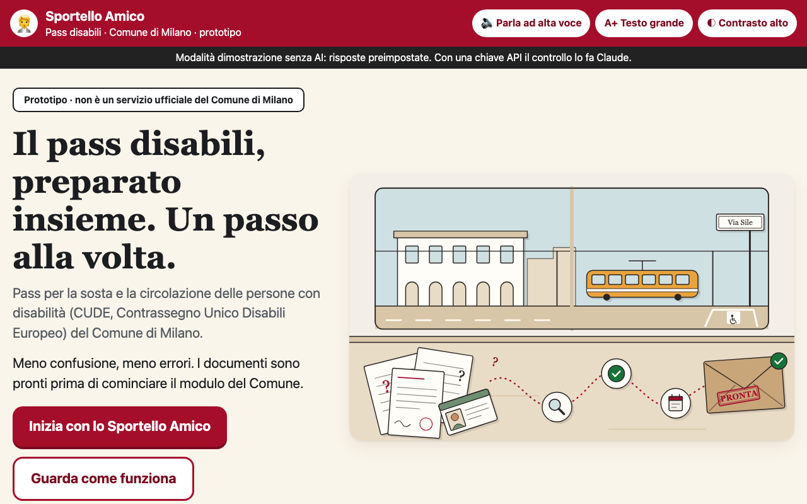
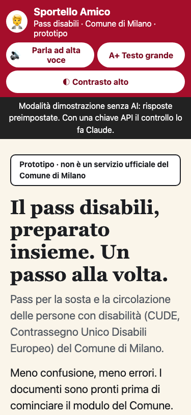
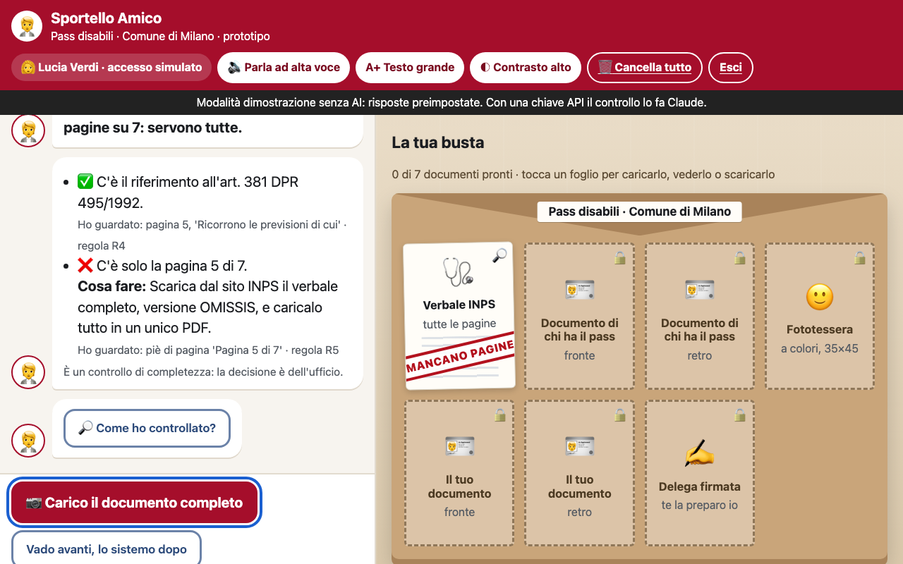
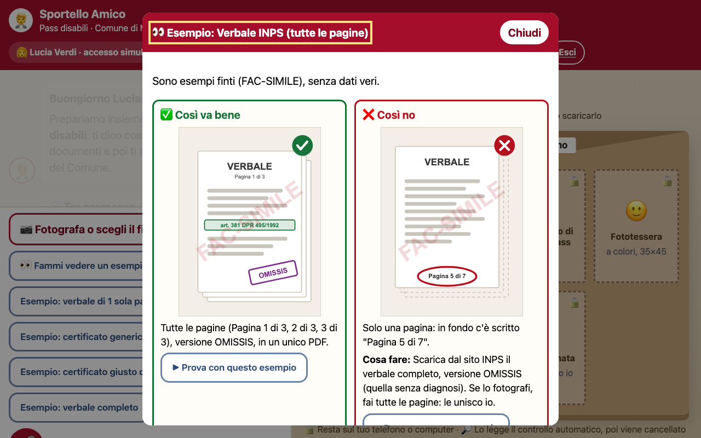
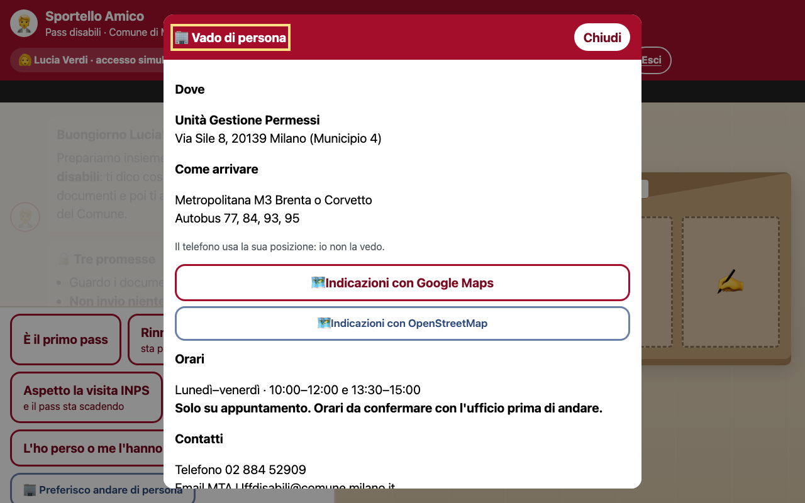

# Sportello Amico: pass disabili

> ✏️ **DA COMPILARE prima del rilascio**: cerca `TODO` in questo file. Ogni campo mancante è segnato così.

**Track 02: Assisted procedure.** A friendly counter clerk who helps people prepare the application
for the disability parking pass (CUDE) of the Comune di Milano: easy for older people, and privacy-first.
It guides, checks, explains and helps avoid mistakes. **It never submits anything**: the person sends
the application on the Comune's official site, and the pass office decides.

| | |
|---|---|
| **Team** | Massimiliano Mancini Tortora, Francesca Sampietro, Iuliia Vorobiova, Ricardo Matamoros, Reda Charf ([details](#team)) |
| **Live demo** | TODO: production URL |
| **Video / slides** | [60-second demo video](docs/video/sportello-amico-demo.mp4) (mock mode, synthetic voice) · [Pitch deck](docs/pitch/SportelloAmico_pitch.pptx) |
| **Repository** | https://github.com/ricardoConsulenze/sportello-amico |
| **Track** | Track 02: Assisted procedure |
| **Event** | Claude Impact Lab Milano, 3 October 2026 |
| **Status** | Prototype. Not an official service of the Comune di Milano |
| **License** | MIT ([LICENSE](LICENSE)) |

## Team
| Name | Contacts |
|---|---|
| Massimiliano Mancini Tortora | massimiliano.mancini.tortora@gmail.com · [LinkedIn](https://www.linkedin.com/in/massimiliano-mancini-tortora/) · GitHub [@MAXMT75](https://github.com/MAXMT75) |
| Francesca Sampietro | francesca.sampietro@gmail.com |
| Iuliia Vorobiova | [LinkedIn](https://www.linkedin.com/in/iuliiavorobiova) |
| Ricardo Matamoros | ricardo.matamoros95@gmail.com · [LinkedIn](https://www.linkedin.com/in/ricardo-matamoros-679284168) |
| Reda Charf | redino98@gmail.com · [LinkedIn](https://www.linkedin.com/in/redacharf/) |

## The problem and who has it
The online CUDE form has 10 screens. Most rejections and requests for missing documents come from a
few traps:
- a disability report (*verbale*) uploaded without all its pages;
- a GP certificate missing the exact wording required for renewal;
- iPhone photos in HEIC, a format the form does not accept;
- an irreversible delivery choice;
- a plate added without the national CUDE platform choice.

The people applying are often older, have reduced mobility, or are family members acting by delegation.

**Personas:**
- **Lucia** (58) applies for her mother Anna (84), who has no SPID.
- **Giorgio** (71) renews his own permanent pass.
- **Samira** is a support administrator (*amministratrice di sostegno*).
- **Paolo** works at the pass office.

**Impact.** TODO: one or two numbers on how many people this affects in Milan (passes issued or renewed per year, share of applications returned for missing documents). Cite the source.

## How it works
0. **Home page**: a story-driven page in plain Italian.
   - Lucia's story and the journey: confusion → guided preparation → document check → ready to submit.
   - A preparation board with everything you need, what the pass allows, timing and validity, and special cases (extension, duplicate, European Disability Card).
   - Our privacy promises, and where to go: the office in via Sile 8, with hours, contacts and how to get there.
   - Custom illustrations (`static/illustrations/`), no stock images and no real data.

   **Simulated login** (`#accesso`): the real service uses SPID, CIE or eIDAS. The demo has *no credential fields*: you pick one of three invented personas. "Esci" (log out) deletes everything.
1. **The counter (chat).**
   - A clerk asks at most 3 questions, with big buttons, an optional 🎤 voice answer and 🔊 read-aloud.
   - Extension and duplicate requests are routed to a phone booking, because the online form does not handle them.
   - Optional **free questions** to a LangGraph chatbot, when it is configured (see [Architecture](#architecture)).
2. **The table and the envelope.**
   - Every required document is an empty sheet in the envelope.
   - **"Fammi vedere un esempio"**: for each document, a "così sì / così no" comparison drawn as FAC-SIMILE illustrations (`static/examples/`).
   - **Where each document goes**: 🔒 "stays on your device" (ID, photo, delegation, plate) or 🔎 "read by the automatic check, then deleted" (only the medical document and the summary screenshot). Each sheet also has a "Perché serve?" note with its official source.
   - When the medical document is photographed, Claude reads it and a stamp comes down: **VA BENE**, **MANCANO PAGINE**, **MANCA LA FRASE**, **DA VERIFICARE**.
   - While the check runs, the steps are shown in plain words. A step is ticked only when the real result arrives. Afterwards **"Come ho controllato?"** says what was looked at, what was not, and that the office decides.
   - The clerk prepares the **delegation form** ready to sign and the **letter for the GP** with the exact wording.
3. **"Accompagnami nel modulo".** A replica of each real Comune screen, with the field to tap highlighted and the value to choose, based on the person's answers.
4. **"Prova generale" (dress rehearsal).** Before pressing *Inoltra*, the person shows a screenshot of the Riepilogo. Claude compares it with their situation and stamps the problems.
5. **Final summary**: everything prepared for the Comune's form (role, request, documents and their status, delivery, plate, open issues). It stays on the device and can be printed. The person submits it themselves.
6. **"Vado di persona"**: for people who prefer the office.
   - Address, hours, contacts, and directions that open in the maps app with the destination only (no location requested).
   - A call script, a pre-written email with placeholders (no personal data), a calendar reminder (.ics) generated on the device, and what to bring.
   - No automatic booking: the Comune has no open booking channel, and booking for someone would mean sending their data.
7. **Office sheet** for Paolo: checks done, rules and official sources, no personal data, plus a JSON export.

| Home | Phone | The envelope after a check |
|---|---|---|
|  |  |  |
| **"Fammi vedere un esempio"** | **"Vado di persona"** | |
|  |  | |

Screenshots in mock mode, with invented personas only.

## Where Claude works
What Claude does every time someone uses Sportello Amico.

| | |
|---|---|
| **Model** | `claude-opus-5-5`, adaptive thinking, effort `high`, structured JSON output, server-side refusal fallback |
| **Call 1: check the medical document** (`/api/check-medical`) | Reads the verbale or certificate (PDF or photos merged into one PDF). Decides the document type, then for each applicable rule (R4/R5 for a first pass, R6/R5 for a permanent renewal) returns *found / missing / not sure*, where it looked, and what to do. Detects missing pages from "Pagina X di Y", the art. 381 / L. 382/70 references, the exemption from future reviews, and the exact R6 sentence. |
| **Call 2: dress rehearsal** (`/api/check-summary`) | Reads the screenshot of the form's summary and compares it with the situation described: role, delivery choice, plate and CUDE platform, missing attachments. |
| **Call 3 (optional): free questions** | LangGraph graph `sportello`, which receives only the non-personal state of the counter. Contract in [docs/INTEGRAZIONE-FE-BE.md](docs/INTEGRAZIONE-FE-BE.md). TODO: link the graph repo, or mark it "not included in this release". |
| **Tools / MCP servers** | None. Claude gets no tools and no MCP servers: it only reads the attached document and returns JSON in a fixed schema (`MEDICAL_SCHEMA`, `SUMMARY_SCHEMA` in `server.py`). The app shows that JSON as stamps and plain-language advice. |
| **Prompts** | `server.py`: `MEDICAL_SYSTEM` and `SUMMARY_SYSTEM`. Rules in `rules.py`, R1–R12, each with its official source. |
| **What Claude decides** | Only whether the documents look complete and consistent with the Comune's published rules. |
| **What a human confirms** | The person reviews everything, signs and submits on the official site themselves. **The pass office decides.** Claude never says "you are entitled", never submits, and says when it is not sure. |

## City sources used
- Online CUDE form: rules, the 10 screens, accepted formats, and the two public sample *verbali* used in the demo
- Service page "Pass per la sosta e la circolazione di persone con disabilità"; extension and duplicate pages
- Official delegation forms (`mod-delega-3`, `mod-delega_agg-09-2024`)
- *Tipologie di procedimento* (Direzione Mobilità): 30-day legal limit, 30-day average in 2025
- disabilita.governo.it: what is national (CUDE, plate platform) and what is municipal

TODO: confirm the office hours and the official channel for in-person appointments with the Comune. One online source gives different days from the service page.

## Architecture
```
browser ──► nginx (static/ + proxy) ──► /api, /demo  ──► Python backend (server.py) ──► Claude
                                    └─► /langgraph   ──► LangGraph Agent Server (optional chat)
```
- **Frontend**: vanilla HTML/CSS/JS, no build step and no CDN. All network calls go through `static/connectors.js`. Runtime config in `static/config.js` is generated from environment variables at container start.
- **nginx**: CSP and security headers, rate limits, privacy-safe access log, JSON error messages in plain Italian. Only the 3 LangGraph calls the frontend needs are exposed. The LangGraph API key is added server-side.
- **Backend**: `server.py` (Python standard library + `anthropic`), stateless, nothing written to disk.
- Integration guide for backend and LangGraph developers: [docs/INTEGRAZIONE-FE-BE.md](docs/INTEGRAZIONE-FE-BE.md). Deployment: [DEPLOY.md](DEPLOY.md).

## How to run it
**With Docker (same as production)**
```bash
cp .env.example .env              # set ANTHROPIC_API_KEY, or MOCK=1
docker compose up --build -d      # http://localhost:8080
.claude/skills/collegamento-fe-be/smoke_test.sh http://localhost:8080
```

**Without Docker.** Requires **Python 3.10 or newer** (check with `python3 --version`).
```bash
python3 -m venv .venv && source .venv/bin/activate
pip install -r requirements.txt
export ANTHROPIC_API_KEY=sk-ant-...
python server.py                  # http://localhost:8765
python server.py --mock           # offline demo without AI (labelled in the UI)
python make_demo_docs.py          # rebuilds the demo documents
```

Test cases ("Esempio" buttons in the app):

| Case | Expected result |
|---|---|
| A: Lucia, verbale with only page 5 of 7 (the Comune's public sample) | MANCANO PAGINE, plus the art. 381 reference found |
| B: Giorgio, generic GP certificate | MANCA LA FRASE, plus the letter for the doctor |
| B2: GP certificate with the exact sentence | VA BENE |
| C: complete fictitious verbale, 3 pages, exempt from reviews | VA BENE |
| D: Lucia's summary screenshot | 3 problems: ID back missing, CUDE choice missing, in-person pickup |

## Accessibility
Large buttons, at most one question at a time, plain Italian, "A+ Testo grande" mode, 🎤 voice answers and 🔊 read-aloud, keyboard navigation, and layouts for phones from 320px.
Audited against WCAG 2.2 AA (axe-core, measured contrast, 320/375/768/1280px, landscape phone, A+ and high contrast). The 5 blocking items found have been fixed:
- page overflow with A+ at 320px;
- low-contrast input borders;
- focus ring on the envelope;
- missing h1/main in the counter;
- focus and title on page change.

Accessibility statement (AgID): to be drafted from the audit. TODO: screen reader test (NVDA, VoiceOver) and tests with older users.

## Privacy
See [PRIVACY.md](PRIVACY.md). In short:
- the ID cards, photo, delegation and plate never leave the browser;
- only the medical document and the summary are sent to Claude;
- nothing is stored, and the logs record no content;
- nothing is sent to the Comune, and there is no automatic booking;
- "Cancella tutto" (delete everything) is always visible, and also deletes the chat on the server.

## For contributors working with Claude Code
Agents in `.claude/agents/`:

| Agent | Role | Changes files? |
|---|---|---|
| `frontend-dev` | builds frontend features | yes |
| `ux-ui-designer` | UX, UI, responsive layout and content | yes |
| `integration-checker` | frontend ↔ backend ↔ LangGraph contracts, release verdict | no, reports |
| `demo-validator` | runs the Lucia, Giorgio and Samira scenarios end to end with `documenti-demo/` (expected vs actual) | no, reports |
| `privacy-security-reviewer` | data flow, GDPR and AI Act points, logs, secrets, CSP, attack surface | no, reports |
| `accessibility-auditor` | WCAG 2.2 AA with measured contrast, keyboard and screen-reader structure, AgID accessibility statement draft | no, reports |

Skills in `.claude/skills/`: `ux-ui-sportello` and `collegamento-fe-be` (with `smoke_test.sh`).

**Release gate.** Before going live, run `demo-validator`, `integration-checker`, `privacy-security-reviewer` and `accessibility-auditor`. All four must say **ready**.

## What is missing for production
Ready today:
- the full flow, with containers and nginx (CSP, rate limits, privacy-safe logs);
- a smoke test;
- the integration guide;
- invented demo documents;
- an accessibility and responsive pass.

The list below is what stands between this prototype and a public service.

**Legal and privacy: blocking.**
- [ ] The Comune is the data controller; a processor agreement with the provider.
- [ ] A data processing agreement with Anthropic, with zero data retention and an agreed processing region.
- [ ] The same agreement with whoever hosts LangGraph.
- [ ] A DPIA: health data from vulnerable people, using AI.
- [ ] A legal basis under art. 9 GDPR, reviewed by the Comune's DPO.
- [ ] A privacy notice (art. 13) and legal notes on the site. AI Act transparency text approved. The notice must also cover the server-side fallback model that may re-read a document after a refusal, and the browser's read-aloud voices (the app now uses on-device voices only).
- [ ] An accessibility statement published on AgID (required for public bodies).

**Content and model quality: blocking.**
- [ ] The pass office signs off rules R1–R12 (`rules.py`), all the texts, the examples and the "Vado di persona" facts. The hours and booking channel are still to be confirmed.
- [ ] Answers to the open questions in [Known limits](#known-limits-and-next-steps).
- [ ] An **evaluation set**: anonymised real verbali and certificates, provided by the office, with the correct outcome. Measure how often the check says "VA BENE" when something is missing (target: never), and how often it says "non sicuro". Re-run it at every prompt or model change.
- [ ] A human review of the first weeks of use, through the office's feedback.

**Backend and integration.**
- [ ] The production backend merged from the `backend` branch, passing the contract in [docs/INTEGRAZIONE-FE-BE.md](docs/INTEGRAZIONE-FE-BE.md) and the smoke test.
- [ ] Production settings: `MOCK` off (refuse to start with `APP_ENV=production` and `MOCK=1`), `/demo` disabled, `demo_docs/` and `static/` not copied into the backend image, demo buttons hidden in the UI.
- [ ] A catch-all error handler in `server.py` (bad `Content-Length` or a non-string `data` currently give a 500).
- [ ] Whitelist the values of `case` and `context` before they go into the prompt.
- [ ] LangGraph, if used:
  - the graph is built, with a `nostream` tag on internal LLM nodes;
  - Postgres and Redis are deployed;
  - threads expire automatically (TTL / `sweep_interval`), so a closed tab never leaves chat text behind;
  - LangSmith tracing is off;
  - the run body is built server-side (e.g. `/api/chat`), so a client cannot set `webhook`, `checkpoint` or `assistant_id` (SSRF risk).
- [ ] A timeout and a fallback message when Claude is slow. Check the 300-second limits against real response times.

**Infrastructure and operations.**
- [ ] A domain and HTTPS on the City's infrastructure; secrets (`ANTHROPIC_API_KEY`, `LANGGRAPH_API_KEY`) in a secret manager.
- [ ] CI (GitHub Actions): build both images, `node --check`, smoke test, secret scan, on every push.
- [ ] Automated tests: unit tests for `rules.py` and the routes in `server.py`, and end-to-end browser tests for the 3 scenarios.
- [ ] Monitoring: uptime and health checks, error rate, latency of the Claude calls. Alerts without content in the logs.
- [ ] Cost control: a spending limit and alerts on the Anthropic account, and rate limits tuned to real traffic.
- [ ] Behind a load balancer: `set_real_ip_from` + `real_ip_header`, otherwise every citizen shares one rate-limit bucket. Add a daily quota per IP, and `limit_req` on `/demo/`.
- [ ] Dependencies pinned with hashes (`requirements.txt` has no versions; move `pypdf`/`pillow` to a dev file). Base images pinned by digest. Update jsPDF to 3.0.2 or later (CVE-2025-29907, CVE-2025-57810).
- [ ] Container hardening: `cap_drop: [ALL]`, `no-new-privileges`, `read_only` root filesystem. Add the `Cross-Origin-Opener-Policy` and `Cross-Origin-Resource-Policy` headers.
- [ ] Log retention defined with the DPO. Today IPs are truncated, chat thread ids are masked, and Docker logs rotate at 3 × 10 MB.
- [ ] A load test for application peaks.
- [ ] Remove `'unsafe-eval'` from the CSP: it is needed only by the HEIC converter, which is no longer maintained. Options: run it in a Worker with its own CSP, use libheif in WASM (`'wasm-unsafe-eval'`), or rely on iOS converting HEIC to JPEG when the file input accepts only JPEG/PNG/PDF.

**Accessibility and UX.**
- [ ] Tests with real users (older people, family members, office staff) and with screen readers (NVDA, VoiceOver).
- [ ] An `accessibility-auditor` report with no blocking items.
- [ ] Optional: real SPID/CIE login, only if a future feature needs identity. Today none does.

## Known limits and next steps
- Questions for the Comune:
  - whether the person who signs the delegation must also attach their ID;
  - how to explain the OMISSIS version;
  - the photo requirements;
  - office hours and the booking channel.
- No real SPID/CIE login: the access is simulated.
- The LangGraph chat needs its graph and server to be deployed.
- TODO: anything else the team wants to declare (e.g. features shown in the demo but not finished).

## Day one: what the City needs to switch it on
1. **Ownership and privacy.**
   - The Comune is the data controller, and the provider is the processor.
   - A data processing agreement with Anthropic, covering retention and zero data retention.
   - A DPIA, because the service handles health data from vulnerable people.
   - Details in [PRIVACY.md](PRIVACY.md).
2. **Content sign-off.** The pass office confirms rules R1–R12 (`rules.py`), the office hours, the in-person booking channel and the open questions above.
3. **Hosting.** Two containers (`docker compose`, see [DEPLOY.md](DEPLOY.md)) behind the City's HTTPS, with the API key in its secret manager.
4. **Link from the official page.** A link from the Comune's service page, labelled as a help tool. The official form and the office's decision stay as they are.
5. **Optional.** Real SPID/CIE login, and the LangGraph chat for free questions.

## Submission checklist (deadline 16:00)
From the event's SUBMISSION.md:
- [x] The repo is public, with an open source licence (MIT)
- [ ] README based on `templates/PROJECT_README.md`. TODO: compare its headings with this file, which we have not seen yet
- [ ] README complete, track named (Track 02: done), TODO fields filled in
- [x] "Where Claude works" section written: model, prompts, tools/MCP, what Claude decides, what a human confirms
- [x] Demo video recorded and linked above (60 seconds)
- [ ] No personal data anywhere: code, data files, screenshots, video. The demo personas and documents are invented or are the Comune's public samples; use only the personas in the video
- [ ] No API keys in the repo (`.env` is in `.gitignore`; a scan found no keys)
- [ ] Submitted once, with the Submission issue form

**Pitch (2 minutes):** problem 20″ (the 5 traps, Lucia) · demo 60″ (case A → MANCANO PAGINE, examples, final summary) · Where Claude works 20″ · Day one 20″.
